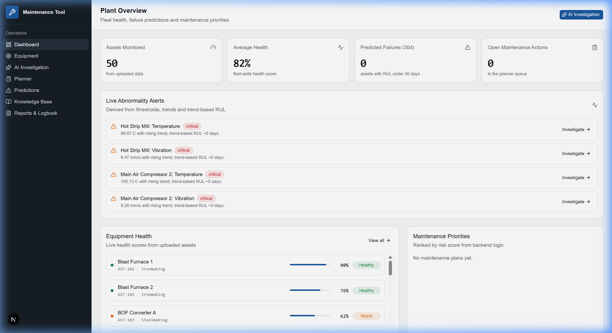
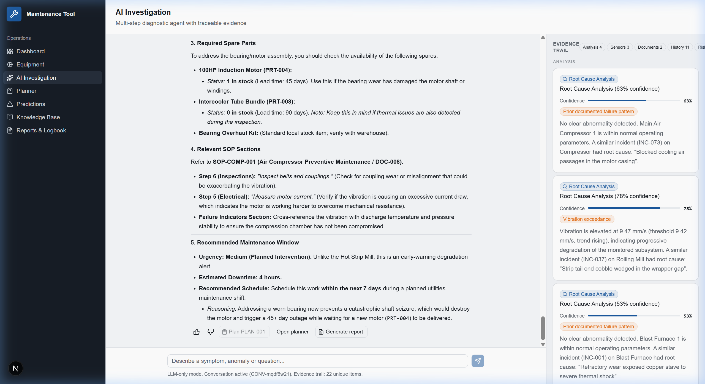
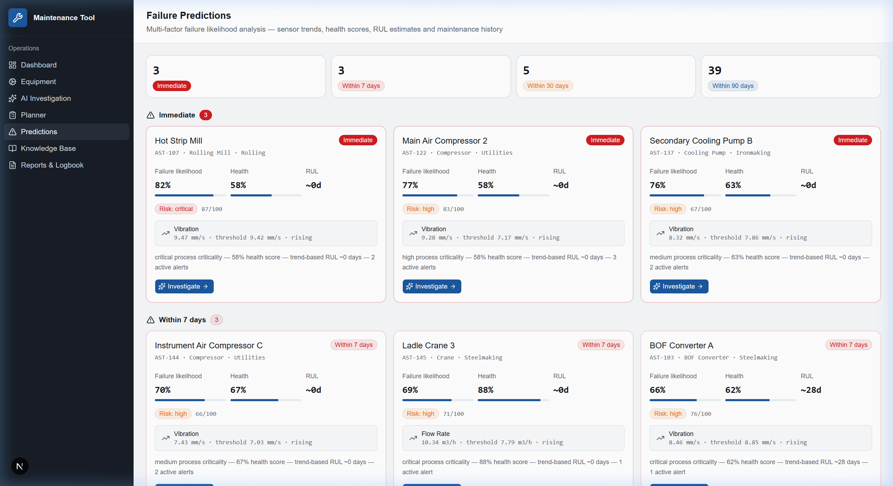
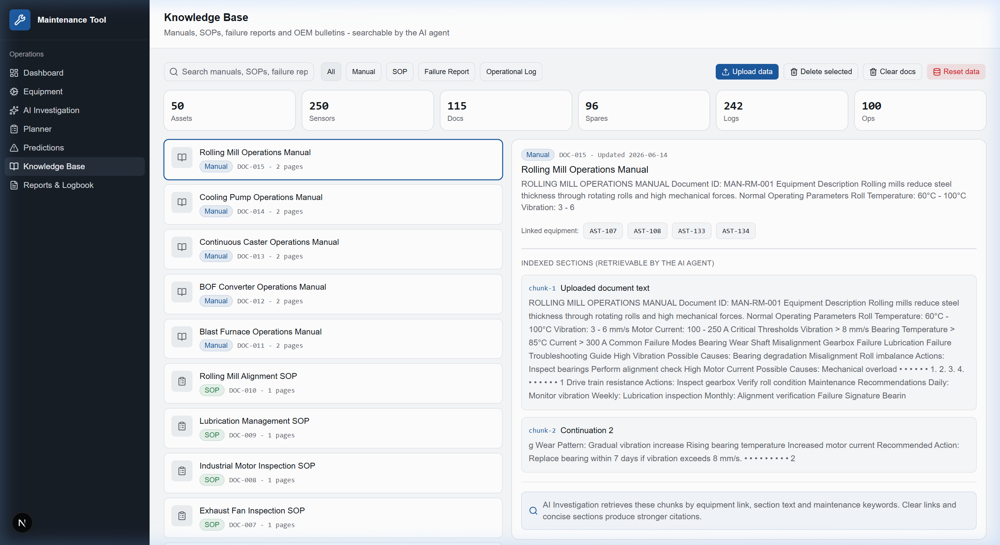

# Maintenance Tool

AI-powered maintenance assistant for steel plant operations. Upload real plant data (CSVs, PDFs, manuals), get sensor-driven alerts, failure predictions, root cause analysis, and actionable maintenance plans -- all backed by LLM contextual reasoning.

Built for the Agentic AI Hackathon (Round 2).

## Screenshots

### Dashboard


### AI Investigation


### Failure Predictions


### Knowledge Base


## Tech Stack

- **Frontend**: Next.js 16, React 19, TypeScript, Tailwind CSS v4, Shadcn UI, Recharts
- **Backend**: Express.js, TypeScript, Node.js 20+
- **LLM**: Gemini 3.5 Flash via OpenAI-compatible endpoint
- **Storage**: JSON file store (no external DB needed)

## Quick Start

**Backend** (Terminal 1):

```bash
cd backend
cp .env.example .env  # add your Gemini API key
npm install
npm run dev            # runs on :4000
```

**Frontend** (Terminal 2):

```bash
cd frontend
npm install
npm run dev            # runs on :3000
```

Open http://localhost:3000. Go to Knowledge page and upload the sample data from `data/` folder.

## Project Structure

```
backend/          Express API, reasoning engine, data ingestion
frontend/         Next.js UI
data/             Sample CSVs, SOPs, and equipment manuals
  SOPs/           10 standard operating procedures (PDF)
  manuals/        5 equipment operation manuals (PDF)
```

## Sample Data

The `data/` folder has ready-to-use files for 50 steel plant assets:

- `assets.csv` -- equipment master (50 assets across blast furnace, BOF, caster, rolling mill, etc.)
- `sensor_data.csv` -- 91k+ sensor readings (temperature, vibration, pressure, current, flow)
- `maintenance_history.csv` -- 242 maintenance records
- `failure_reports.csv` -- 100 failure incidents
- `spare_inventory.csv` -- 96 spare parts

## Demo Flow

1. Upload CSVs + PDFs from the Knowledge page
2. Dashboard shows fleet health, active alerts, maintenance priorities
3. Open AI Investigation -- ask about equipment risks, abnormalities, root causes
4. Agent shows tool steps, evidence cards, citations, risk scores, RUL estimates
5. Create a maintenance plan directly from the investigation
6. Generate a report, check the digital logbook
7. Give feedback (thumbs up/down) -- it feeds into future agent context

## LLM Config

Set in `backend/.env`:

```
LLM_API_KEY=your_gemini_key
LLM_BASE_URL=https://generativelanguage.googleapis.com/v1beta/openai
LLM_MODEL=gemini-3.5-flash
```

The chat endpoint needs a working key. No fallback fabrication -- if the LLM is down, you get an error.

## Docs

- [Architecture](ARCHITECTURE.md) -- system design, reasoning pipeline, data model
- [Backend](backend/README.md) -- API reference, supported inputs, environment setup
- [Frontend](frontend/README.md) -- screens, data flow, dev commands
